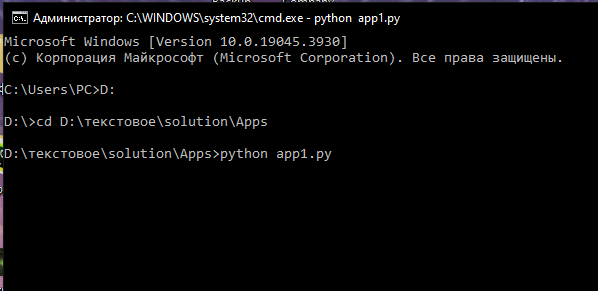

# Решение к заданию
## Задание:

Реализовать 2 приложения, которые обмениваются синхросигналами через шину данных 
(брокер сообщений NATS streaming STAN или RabbitMQ):
- приложение 1 записывает тик времени в основном потоке раз в 10 мс и асинхронно 
передает в шину данных
- приложение 2 считывает из шины данных и выводит в консоль dt, 
где "dt=t_real- t_sign", где t_real - UNIXTIME время приема 
сообщения в сек.мс (округление до мс), t_sign - время в теле сообщения
- приложение 2 аналогично асинхронно отправляет свой тик времени 
в приложение 1, которое в свою очередь выводит в консоль dt.

# При разработке использовались:

- Язык `Python`
- Брокер сообщений `NATS`
- Docker

# Установка

Установка стороннего ПО для проекта: [**NATS**](https://docs.nats.io/running-a-nats-service/introduction/installation)

Качаем репозиторий

```bash
git clone https://github.com/Katabym/ServerTask.git
```

В файле `config.py` пишем IP-адресс или доменное имя сервера NATS.
И порт для подключения к нему.

По умолчанию прописан `localhost` и порт `4222`

```bash
your_ip = "localhost"
port = "4222"
```

Устанавливаем библиотеку `nats-py`:

```bash
pip install -r
#или
pip install nats-py
```

# Запуск

Запускаем сервер NATS.

```shell
docker run -p 4222:4222 -ti nats:latest
```

Переходим в директорию с приложениями
```shell
cd solution/Apps
```

Запускаем `app1.py`
```shell
python app1.py
```
Запускаем `app2.py`

```shell
python app2.py
```

# Результаты

При запуске одного приложения(любого из двух) консоль будет пуста. Записанный приложением тик времени начнет передаваться в шину данных каждые 10 мс.

|  |
|---------------------------------|

При запуске второго приложения в обоих консолях каждые 10 мс будут выводиться результаты найденного dt.

  |
|---------------------------------|

При остановке одного из приложений консоль второго приложения перестанет выводить новые результаты. Но записанный работающим приложением тик времени продолжит передаваться в шину данных каждые 10 мс.

При повторном запуске остановленного приложения в обоих консолях снова начнут выводиться результаты dt.
